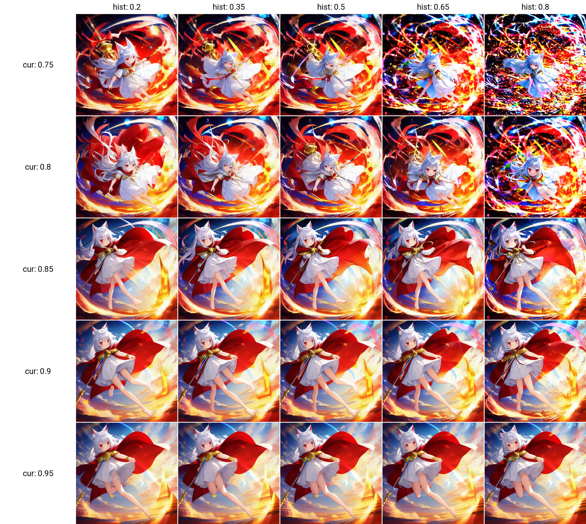
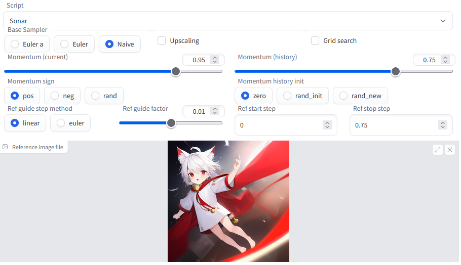

# stable-diffusion-webui-sonar

    Wrapped k-diffuison samplers with tricks to improve the generated image quality (maybe?), extension script for AUTOMATIC1111/stable-diffusion-webui

----

  
  
  
  
  
  
   

ℹ This is the sister repo of [https://github.com/Kahsolt/stable-diffusion-webui-prompt-travel](https://github.com/Kahsolt/stable-diffusion-webui-prompt-travel), it focuses on **single prompt optimization** rather than traveling between multiple prompts. 

The core idea of Sonar is to search for similar (yet even better!) images in the **neighborhood** of some known image generated by a normal denoising process. 
Technically to do this, we hack into the samplers and sampling processing, do some tricks like:

  - momentum on latent difference
  - txt2img under hard guidance of another given image (yet another img2img-like in a **shallow fusion** manner...)

to get image latents with higher quality (~perhaps!), and just pray again for good results 🤣

⚠ 我们成立了插件反馈 QQ 群: 616795645 (赤狐屿)，欢迎出建议、意见、报告bug等 (w  
⚠ We have a QQ chat group now: 616795645, any suggeustions, discussions and bug reports are highly wellllcome !!  

### Change Log

⚪ Compatibility Warning

- 2023/01/04: webui's recent commit [#bd68e35de3b7cf7547ed97d8bdf60147402133cc](https://github.com/AUTOMATIC1111/stable-diffusion-webui/commit/bd68e35de3b7cf7547ed97d8bdf60147402133cc) saves memory use in forward caculation, but totally ruins backward gradient caculation via `torch.autograd.grad()` which this script heavily relies on. This change is so far not pluggable but forcely applied, so we're regrettable to say, sonar's `grad` optimization part will be broken henceforth. (issue #1 cannot be fixed)

⚪ Features

- 2023/03/09: switch between two morphs (as AlwaysVisible for working with other scripts, as Script for supporting auto grid search)
- 2023/03/08: add grid search (free your hands!!)
- 2023/01/28: add upcale (issue #3)
- 2023/01/12: remove gradient-related functionality due to webui code change
- 2022/11/27: add momentum on `Euler`, add hard ref-image guidance on `Naive`
- 2022/11/20: add an Euler-like `Naive`, the simplest difference-estimation-based sampler with momentum & gradient
- 2022/11/18: add momentum on `Euler a`

⚪ Fixups

- 2023/01/28: keep up with webui's updates (issue #4: `NameError: name 'CFGDenoiser' is not defined`)
- 2023/01/28: keep up with webui's updates of extra-networks
- 2023/01/12: keep up with webui's updates (issue #2: `AttributeError: 'Options' object has no attribute 'filter_nsfw'`)
- 2023/01/03: keep up with webui's updates (issue #1: `AttributeError: 'StableDiffusionProcessingTxt2Img' object has no attribute 'firstphase_height'`)

### Examples

⚪ momentum

How momentum works:

- Basically at each sample step, the denoiser will modify the latent image by a `dx`
  - using [sd-extension-steps-animation](https://github.com/vladmandic/sd-extension-steps-animation) you can inspect into the sampling process
  - this `dx` is also to some extent understood as `gradient` or `differential`
- And the sigma schedule (like `karras`) controls denoiser's step-size (i.e. magnitude of `dx`), to assure the process annealing so that the final output converges at some place
  - see [damping signal](https://en.wikipedia.org/wiki/Damping#Damped_sine_wave)
- Momentum mechanism memorizes kind of history of `dx`, and is used to increase (when `pos`) or reduce (when `neg`) the damping magitude
  - a bit like the `LMS/PLMS` sampler, but works on gradient level
  - by this way, you can anneal your noisy latent image to some other places nearby (works like subseed...)
  - by this way, **you could retain some details which is normally taken as noise and removed by a denoiser** (subseed might not be capable for this)

<del> Parameter tuning reference: </del>

- set `Momentum (current)` to `1`, this will give you an image without momentum mechanism
- tune `Momentum (current)` and `Momentum (history)` to see what will vary...
  - `Momentum (current)` is weighted-accumulated 1st-order gradient, usually should `>= 0.85`
  - `Momentum (history)` is weighted-accumulated of all higher-than-1st-order gradients 
  - probably keep `Momentum sign = pos` and `Momentum history init = zero`
  - because other parameters are pure experimental and I could not explain in brief... 🤣

**=> Just run a grid search first:**

- set `Momentum (current) search list` and `Momentum (history) search list`
- the full syntax is `<start>:<stop>:<step>`:
  - `0.75:0.95:5` => `[0.75, 0.8, 0.85, 0.9, 0.95]`, when `step > 1` is an int, parse as step count
  - `0.95:0.75:-0.1` => `[0.95, 0.85, 0.75]`, when `-1.0 < step < 1.0` is a float, parse as step size
  - `0.75:0.95` => `[0.75, 0.85, 0.95]`, by default `step=3`
  - `0.75` => `[0.75]`, just one constant
  - when left empty, will read from the Slider value accordingly
- run Generate!

⚪ ref_img guide

⚠ Above images are not intented to show the best results, but showing the trendency. You shall carefully tune these hparams all by yourself to get good results. 🤣

How hard ref_img guidance works:

- **After** each denoise step, make an extra step towards the given image in latent space
- It is a kind of shallow fusion, thus ...
  - in fact needs a carefully step-size scheduling, but not implemented yet :(
  - when the given condition (the digested prompts) mismatches the ref_img very much, they will fight, and the canvas would be again and again overwriten, giving bad final results 🤣

### Options

- base_sampler: (categorical)
  - `Eular a`: `Eular` with ancestral noise sampling
  - `Eular`: `Eular` the original
  - `Naive`: a so simple, sometimes naive sampler but to start anything from
- momentum_*
  - momentum: (float), momentum of current latent difference
    - the larger, approving the current difference, (set `1.0` to **disable** momentum mechanism)
    - the smaller, approving the history difference momentum
  - momentum_hist: (float), momentum of memorized difference history
    - the larger, approving current history
    - the smaller, approving former histories
  - momentum_hist_init: (categorical), init value of history, aka. the genesis (experimental)
    - `zero`: use the first denoised latent
    - `rand_init`: just use the init latent noise 
    - `rand_new`: use a new guassian noise
  - momentum_sign: (categorical), momentum direction to apply correction (experimental)
    - `pos`: correct by direction of history momentum, affirming the history
    - `neg`: correct by opposite direction of history momentum, denying the history
    - `rand`: random choose from above at each sampling step
    - NOTE: option `neg` works well only if `momentum_hist` is enough large (`~0.9`)
- ref_*
  - ref_img: (file), reference image file
  - ref_meth: (categorical)
    - `linear`: linear interpolate between current and ref latent
    - `euler`: make an eular step from current to ref latent 
  - ref_start_step: (float, int)
  - ref_stop_step: (float, int)
    - sampling step range which enables the ref guidance mechanism (kind of scheduling)
    - if > 1, parse as step number; if <= 1, parse as percentage of total steps
- upscale_*
  - upscaler: (categorical)
  - ratio: (float)
  - width: (int)
  - height: (int)
    - if `width==height==0`, upscale by the specified ratio
    - if `width==0 or height==0`, the zero one will be auto calculated to match the non-zero one, keeping the aspect-raio
    - if `width!=0 and height!=0`, upscale while keeping the aspect-raio to cover the target size, then crop the excess if necessary

### Developers

This repo allows your to quickly implement your own k-diffusion samplers, follow to do this:

- creart a sampling procedure `sample_<name>()`, you can refer to the skeleton sampler `sample_naive()`
- add a `SamplerData` entry in `all_samplers_sonar`
- design ui components for your sampler hparams in `ui()`, then modify `swith_sampler()` to show/hide related tabs
- restart webui and play with your own sampler~

### Installation

Easiest way to install it is to:
1. Go to the "Extensions" tab in the webui, switch to the "Install from URL" tab
2. Paste https://github.com/Kahsolt/stable-diffusion-webui-sonar.git into "URL for extension's git repository" and click install

Manual install:
1. Copy this repo folder to the 'extensions' folder of https://github.com/AUTOMATIC1111/stable-diffusion-webui

----

by Armit
2022/11/16 
