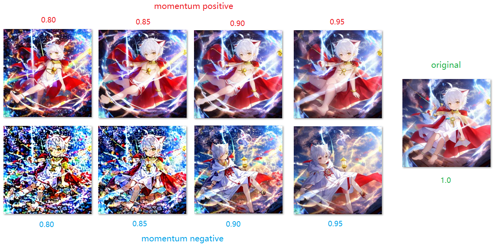

# stable-diffusion-webui-sonar

    Wrapped k-diffuison samplers with tricks to improve the generated image quality, extension script for AUTOMATIC1111/stable-diffusion-webui

----

ℹ This is the sister repo of [https://github.com/Kahsolt/stable-diffusion-webui-prompt-travel](https://github.com/Kahsolt/stable-diffusion-webui-prompt-travel), it focuses on **single prompt optimization** rather than traveling between multiple prompts. 

The core idea of Sonar is to search for similar (yet even better!) images in the **neighborhood** of some known image generated by a normal denoising process. 
Technically to do this, we hack into the samplers and sampling processing, do some tricks like:

  - momentum on latent difference
  - sample-wise optimzaton on prompt condition and image latent
  - txt2img under hard guidance of another given image (yet another img2img-like in a **shallow fusion** manner...)

to get image latents with higher quality (~perhaps!), and just pray again for good results 🤣

⚠ 我们成立了插件反馈 QQ 群: 616795645 (赤狐屿)，欢迎出建议、意见、报告bug等 (w  
⚠ We have a QQ chat group now: 616795645, any suggeustions, discussions and bug reports are highly wellllcome !!  

### Change Log

- 2022/11/27: add momentum on `Euler`, add hard ref-image guidance on `Naive`
- 2022/11/20: add an Euler-like `Naive`, the simplest difference-estimation-based sampler with momentum & gradient
- 2022/11/18: add momentum on `Euler a`

⚪ momentum

⚪ grad on condition

⚪ grad on latent

⚪ ref_img guide

⚠ Above images are not intented to show the best results, but showing the trendency. You shall carefully tune these hparams all by yourself to get good results. 🤣

### Options

- prompt: (string)
- base_sampler: (categorical)
  - `Eular a`: `Eular` with ancestral noise sampling
  - `Eular`: `Eular` the original
  - `Naive`: a so simple, sometimes naive sampler but to start anything from
- momentum_*
  - momentum: (float), momentum of current latent difference
    - the larger, approving the current difference, (set `1.0` to **disable** momentum mechanism)
    - the smaller, approving the history difference momentum
  - momentum_hist: (float), momentum of memorized difference history
    - the larger, approving current history
    - the smaller, approving former histories
  - momentum_hist_init: (float), init value of history, aka. the genesis
    - `zero`: use the first denoised latent
    - `rand_init`: just use the init latent noise 
    - `rand_new`: use a new guassian noise
  - momentum_sign: (categorical), momentum direction to apply correction
    - `pos`: correct by direction of history momentum, affirming the history
    - `neg`: correct by opposite direction of history momentum, denying the history
    - `rand`: random choose from above at each sampling step
    - NOTE: option `neg` and `pos_neg` works well only if `momentum_hist` is enough large (`~0.9`)
- grad_*
  - grad_w_cond: (float), loss weight for optimizing prompt condition
  - grad_c_iter: (int), optimizing step count **per sampling step** for condition
  - grad_c_alpha: (float), optimizing step size for condition
  - grad_c_skip: (int), skip cond optimizing for the first n-steps
  - grad_w_latent: (float), loss weight for optimizing image latent
  - grad_x_iter: (int), optimizing step count for latent (this is NOT per sampling step)
  - grad_x_alpha: (float), optimizing step size for latent
  - grad_fuzzy: (bool), use fuzzy gradient for both
- ref_*
  - ref_img: (file), reference image file
  - ref_meth: (categorical)
    - `linear`: linear interpolate between current and ref latent
    - `euler`: make an eular step from current to ref latent 
  - ref_start_step: (float)
  - ref_stop_step: (float)
    - sampling step range which enables the ref guidance mechanism (kind of scheduling)
    - if > 1, parse as step number; if <= 1, parse as percentage of total steps

### Developers

This repo allows your to quickly implement your own k-diffusion samplers, follow to do this:

- creart a sampling procedure `sample_<name>()`, you can refer to the skeleton sampler `sample_naive()`
- add a `SamplerData` entry in `all_samplers_sonar`
- design ui components for your sampler hparams in `ui()`, then modify `swith_sampler()` to show/hide related tabs
- restart webui and play with your own sampler~

### Installation

Easiest way to install it is to:
1. Go to the "Extensions" tab in the webui, switch to the "Install from URL" tab
2. Paste https://github.com/Kahsolt/stable-diffusion-webui-sonar.git into "URL for extension's git repository", click "install" button
3. Go to the "Installed" tab, click "Apply and Restart UI" button

Manual install:
1. Copy this repo folder to the 'extensions' folder of https://github.com/AUTOMATIC1111/stable-diffusion-webui
2. Go to the "Settings" tab, click "Restart Gradio and Refresh components" button

----

by Armit
2022/11/16 
